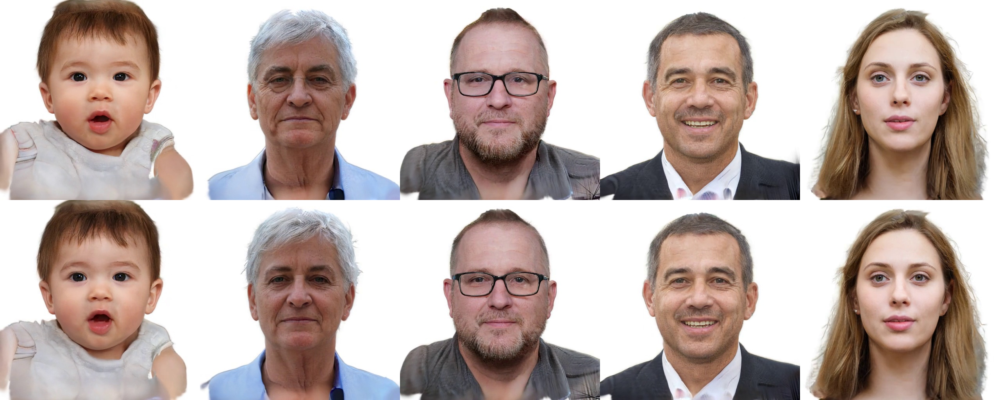

This repository demonstrates our work, an encoder for GGHead inversion. Our encoder consists two parts: one encoder mapping the images into GGHead latent space; a triplane encoder to generate a new triplane providing additional offset to the original triplane of GGHead, in order to get better results for custom data inversion.

## Experiment Results

Upper line shows the original result of GGHead and bottom line demonstrates inversion results.




## Installation

Create conda environment with the following command:

```
conda env create -f environment.yml
conda activate gghead
conda install -c "nvidia/label/cuda-11.8.0" cuda-toolkit ninja
ln -s "$CONDA_PREFIX/lib" "$CONDA_PREFIX/lib64"
conda env config vars set CUDA_HOME=$CONDA_PREFIX
conda deactivate
conda activate gghead
pip3 install torch torchvision torchaudio --index-url https://download.pytorch.org/whl/cu118
pip install eg3d@git+https://github.com/tobias-kirschstein/eg3d.git
pip install gaussian_splatting@git+https://github.com/tobias-kirschstein/gaussian-splatting.git
```

After that, using the following command to makesure CUDA is available:

```
conda activate gghead
nvcc --version
```

## Environment Settings and Data Preparation

Follow the instructions of GGHead [here](https://github.com/tobias-kirschstein/gghead?tab=readme-ov-file#12-environment-paths).

Download the pre-trained [models](https://nextcloud.tobias-kirschstein.de/index.php/s/49pojneNNMMmew4) into ${GGHEAD_MODELS_PATH}/gghead

We have trained for 0-100 seeds of GGHead, and the weight file is [here](https://drive.google.com/drive/folders/15YPw9QePUwMJwZlzcQXHcLF-tQjHy42s?usp=sharing), you can download it and put it into ./ckpt/

## Usage

In our experiments, we train the model on a single RTX 3090ti GPU, with batch size of 6 512X512 images.

Using the following command to train for a single id.

```
python ./scripts/inversion.py --run_name GGHEAD-1 --n_styles=14 --id_index 150 --iteration 40000 --stop_encoder 40000 --triplane 10000 
```

<details>
<summary><span style="font-weight: bold;">Command Line Arguments</span></summary>

  - `--run_name`
  The name of the model you want to train for.

  - `--n_styles`
  The dimension of the latent space.

  - `--id_index`
  Point the specific id to train for, only for single inversion use.

  - `--iteration`
  Total training iteration.

  - `--stop_encoder`
  Stop training encoder reaching the provided step.

  - `--triplane`
  Begin to train triplane from the provided step.

  - `--E_cpkt`
  Encoder checkpoint (Optional).

  - `--triplane_ckpt`
  Triplane checkpoint (Optional).
  
  - `--resume_step`
  For resume training use.

</details>

Using the following command to train for the entire dataset.

```
python ./scripts/train.py --run_name GGHEAD-1 --n_styles=14 --iteration 2000000 --stop_encoder 2000000 --triplane 1000000
```

Further parameter settings can be seen in ./src/gghead/config/infer_config.py

Use the following command to get the inversion result of certain image.

```
python ./scripts/inference.py --run_name GGHEAD-1 --image_path "./test_data/114.jpg" --E_ckpt "./ckpt/Encoder.pth" --triplane_ckpt "./ckpt/Triplane.pth"
```

Use the following command to get the demo view of certain id to see the differences. You can also use "./scripts/generate.py" to get a series of front view heads.

```
python ./scripts/sample_heads.py --seeds 114
```

Due to the characteristic of StyleGAN-like structure, we can manipulate the different dimension of latent w to achieve some edit effects. Put the image you want to edit under ./test_data/

```
python edit.py --run_name GGHEAD-1 --n_styles=14 --id_index 150 --w_start 0 --w_end 199 --sigma 5
```

<details>
<summary><span style="font-weight: bold;">Command Line Arguments</span></summary>

  - `--run_name`
  The name of the model you want to train for.

  - `--n_styles`
  The dimension of the latent space.

  - `--id_index`
  Point the specific id to train for, only for single inversion use.

  - `--w_start`
  Dimension start to edit.

  - `--w_end`
  Dimension end to edit.

  - `--sigma`
  Edit factor.

</details>

## Weight Files

Put pre-trained models into `./ckpt/`. 

| Dataset   | Encoder model             |
|-----------|---------------------------|
| GGHead 0-100  | [GGHEAD-1_0_100](https://drive.google.com/drive/folders/15YPw9QePUwMJwZlzcQXHcLF-tQjHy42s?usp=sharing)  |
| FFHQ-512  | TODO  |
| FFHQ-1024 | TODO  |
| AFHQ-512  | TODO  |

## TODO

We are still working on this repository, thanks for your patience. 

- [x] Experiments demo of our method.
- [x] Tutorial for installation and usage.
- [ ] The encoder weight files for the entire dataset.


## Acknowledgement

Our code is based on following repositories:

* [GGHead](https://github.com/tobias-kirschstein/gghead)
* [TriPlaneNet](https://github.com/anantarb/triplanenet)
